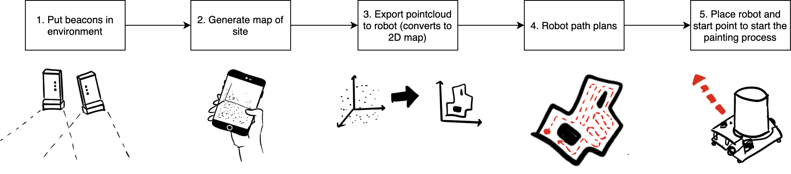
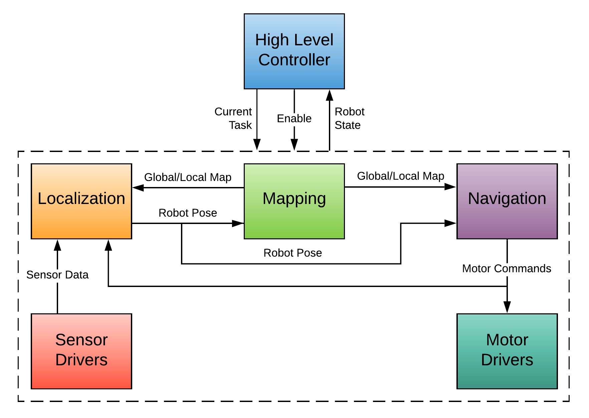

# roomba-autonomy
## Introduction
This is the main repository for codebase of the PaintJet autonomous painting robot project. The objective of the project is to design a modular robotic platform for high-volume, low-quality painting of large buildings like warehouses. The initial iteration of the robot will be designed to apply epoxy to the floor of these warehouses. The software is first being developed for a Roomba Create 2, a prebuilt robotic platform that allows us to quickly test and iterate on our code.

This codebase includes software for autonomous localization, mapping, and navigation for the robot as well as the controls for applying epoxy to the floor. Each of the subfolders are ROS packages containing code for the various functions of the robot. A brief explanation of each packages is presented below in Packages and the details of each package are provided in the ReadMe files in each package.

## Project Goals

Our goal was to create a workflow for the painting robot that would work well with the current painting process. The following diagram describes the desired workflow we are aiming to achieve:




## Software Structure
To accomplish this desired workflow, we divided our autonomy stack into 6 subcomponents: motor drivers, sensor drivers, localization, mapping, navigation, and a high-level controller. The following diagram describes how each of these components interact.



We have a detailed breakdown of each of these components in **SOFTWARE STRUCTURE page** in the documentation directory.

# Using our Software
## Installation and Setup
This guide assumes that you have already installed ROS Melodic (for Ubuntu 18.04) and that you have an understanding of ROS. Navigate to the `src` directory inside your `catkin_ws` and clone this repository.

```
cd ~/catkin_ws/src
git clone https://github.com/PaintJet/roomba-autonomy.git
```

Navigate back to the top directory of the `catkin_ws` and run `catkin_make`
```
cd ~/catkin_ws
catkin_make
source ~/catkin_ws/devel/setup.bash
```

## Usage
To launch the entire robot software, a couple of steps have to be executed.

1. Launch roscore on main computer
2. Ssh into raspberry pi and launch roomba_launch.launch
3. On main computer, launch a static transform publisher between map and odom frame
4. On main computer, launch mapping.launch
5. on main computer launch lidar_angle_filter.launch
6. On main computer, rosrun particle_filter.py and follow setup steps until filtering begins
7. On main comptuer, kill map --> odom transform publisher
8. On main computer, launch navigation.launch

#### Problems to fix
* Order dependence on launching parts of the program
* Switch away from using octree to do occupancy grid generation
* Fix particle filter not running

## Launch files

## Packages

### aruco_localization
Software for determining the location of a camera relative to an ArUco marker placed in the environment. This package was developed for testing the performance of this localization method, but is no longer being used for localization due to poor performance at long distance and large angles.

### teleop_control
Allows the robot to be controlled using a joystick. This is used for testing purposes of the motor control code. The code in this package provides the same output at the autonomy stack does. Therefore, we can run the motors the same way the autonomous control code would.

### uwb_localization
Localization of the robot using the Decawave DWM1001 ultra-wide band modules. This is the method the robot is currently using for localization. This package depends on the [DWM1001-Interface](https://github.com/PaintJet/DWM1001-Interface) package in the PaintJet organization. This package does not do robot localization in isolation, but instead uses the DWM1001-Interface to read data from multiple Decawave tags and publish it to topics for other packages to use.

### sensor_filtering_and_fusion
Implements filtering algorithms for sensor data to get useful outputs. This package is the main package responsbile for outputting the pose/state of the robot. To generate a stable state estimate, the package implements a particle filter to fuse the incoming sensor data.

### mapping
The mapping packages implements the code to receive a pointcloud map and translating it into a 2D occupancy grid and costmap for the other packages in the codebase to use for localization and path planning.

### navigation
The navigation package implements path planning and path following algorithms that generate motor commands for the robot. The path planning algorithm will take the pre-generated floor map from the mapping service and generate a route around it that efficiently covers the floor. Additionally, the package will take pose and velocity of the robot and generate motor commands to follow the path.

# Contributors
This repository was developed as a Senior Design/Capstone project for Mechanical Engineering @ Vanderbilt University in 2019-2020. The main software contributors are [Swapnil Pande](https://www.github.com/SwapnilPande), [John Mark Goeke](https://www.github.com/jmgoeke), and [Sam Gottlieb](https://www.github.com/gottlism). [Emmet Haden](https://www.github.com/emmethaden), [Braden Barnett](https://www.github.com/bradenbarnett), and Charles Tusa were the lead developers on the hardware of the robot.

## Continuing this Project
To the developers who will be taking over this project, the documentation in this repository in combination with our final report should provide enough information to determine how to continue our work.

Any questions can be sent to Swapnil Pande, whose email you can get from Nick Hegeman.


