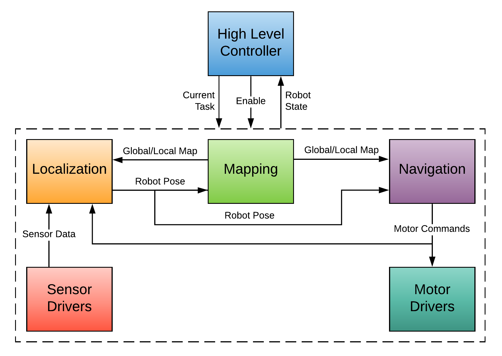

# Software Stack Breakdown

Our entire autonomy stack consists of 6 subcomponents: motor drivers, sensor drivers, localization, mapping, navigation, and a high-level controller. The following figure describes how all of these subcomponents interface with each other.

## Motor Sensors and Drivers
The motors and sensor drivers, on the lowest level of the stack, provide the bridge between the hardware and the software systems of the robot. These communicate with the hardware using low-level communication protocols such as I2C, PWM, and UART and provide an interface in the ROS network to access the devices. The motor drivers are the red section of the diagram. By abstracting the motor and sensor drivers and creating a ROS interface for them, we made it simple to swap out motors and sensors as it requires no change in the higher level autonomy code. This makes it easy to port the autonomy code from the Roomba test platform to the full scale robot.

## Localization

The next level of the stack performs the main autonomy functions: mapping the room, determining the pose of the robot (localization), and generating commands for the robot based to drive around the room (navigation). The next figure provides a more detailed view of the components of the localization subcomponents.

First, before the sensor data is used for pose estimation, it is fed through low-level filters that attenuate a significant amount of high-frequency noise and remove unusable data. For example, the inertial measurement unit (IMU) filtering smooths out noise in the raw sensor reading to provide usable acceleration and orientation estimates. On the other hand, the LIDAR filter removes the range readings from the back half of the 360 degree scan, since this part of the LIDAR is facing the robot. After the preliminary filtering, the sensor data is fed into the particle filter along with the motor commands and the map. All of this data is used to perform sensor fusion and provide an estimate of the pose of the robot.

## Mapping

The first step of the mapping is generating a 3D map in the PointCloud .ply format using ARKit on an iPhone or iPad. This 3D map is then sent over to the robot, which first finds the ground plane and projects the 3D obstacles down to create a 2D map. The format of the 2D map is an occupancy grid which is a 2D array storing a -1 (unknown occupancy), 0 (unoccupied), or 1 (occupied) at each cell. Finally, the occupancy grid is converted into a global costmap, which denotes the associated cost for the robot being in the cell. Cells near obstacles have a non-zero cost and cells with obstacles have the maximum cost. The global costmap supports “layers” of different information. In the final design, the portion of the warehouse that is painted will be added as a layer in this costmap such that the robot avoids driving over the painted portions. The mapping subcomponent also creates a local costmap based on current incoming sensor data that describes the cost of cells in a nearby rectangular region around the robot.

## Navigation

The navigation subcomponent serves two functions. The first function, accomplished by the global planner, is generating a series of waypoints to follow such that the robot covers the entire room. These waypoints are then fed into the local planner, which takes into account the local costmap to generate motor commands to reach each waypoint. These motor commands are sent to the motor drivers to move the robot.
The top layer of the autonomy stack is the high-level controller. This controller will implement a finite state machine that defines the current task of the robot. Based on the task, the high-level controller will send commands to each of the individual subcomponents to perform specific tasks. Currently, the high-level controller is manual, requiring an operator to command the subcomponents.

## ROS Implementation

### ROS Node Structure
Our implementation of these subcomponents in ROS do not perfectly align with the diagrams outlining their functionality. Therefore, the following diagram shows the actual ROS node structure for the autonomy stack. The blocks are nodes which are separate programs communicating with the ROS network. The arrows between the nodes are messages sent over the ROS network containing the necessary data.

The only portion of the ROS node graph that is specific to the Roomba is the /ca_driver node, which sends commands to the drive motors and returns the wheel odometry data. On the full scale robot, this node simply needs to be replaced with a corresponding driver node written to control the drive motors and read the encoders.

In addition to the ROS node graph, our robot system also maintains a transform tree (using the tf2 ROS package) that describes the transformation matrices between each of the links on the robot. The transform tree for our robot is presented below, which we defined based on standards for ROS.

### Transform Tree

The root of the tree is the fixed map frame, relative to which all other frames are defined. The cloud frame defines the transform from the fixed map frame to the imported point cloud data. On the right side of the branch, the center of the robot is defined by the base_footprint and base_link frames (they are in the same position, both are defined for compatibility between multiple packages). We define the pose of all of the sensors and actuators relative to the base_link frame. The most important transforms are the map →  odom →  base_footprint. The odom →  base_footprint transform is published by the motor driver that reads in the wheel odometry data. This transformation describes the position of the robot based on the measurements from the wheel encoders. Since it is using wheel encoders, there will be no discontinuities in this transformation over time. However, it is subject to drift. Therefore, we define the map → odom transformation, which is published by the particle filter. This transformation accounts for the drift in the odometry estimation to provide an accurate pose of the base_footprint relative to the map. This transformation is always accurate but can be discontinuous over time. This structure is defined so that there is an always accurate estimate of the robot pose (map → base_footprint), but there is also a continuously evolving estimation of pose (odom → base_footprint) that can be used for estimation of motion over short time periods.

### Parameter File
This tree structure is not unique to the Roomba. However, the specific transforms between the frames are. To make this architecture portable to the full scale robot, the robot code will accept a configuration file that defines the various transforms and other important parameters that characterize the robot. With this config file, the only changes that will be needed to port to the new robot will be passing the new parameter file. NOTE: The implementation is not mature enough to get parameters from the parameter file. This functionality needs to be added.

